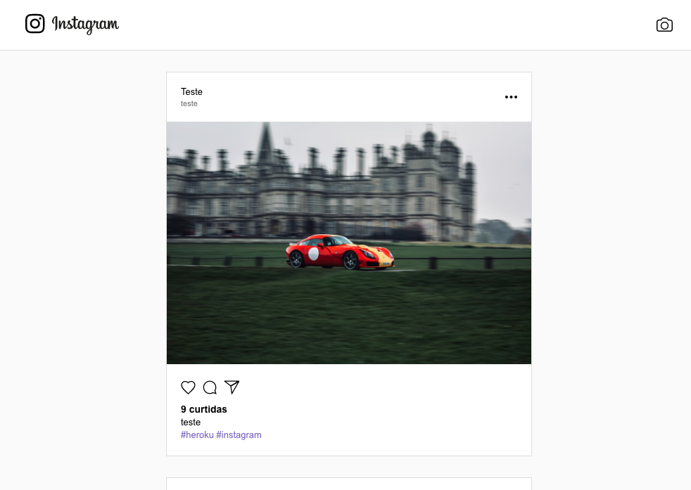
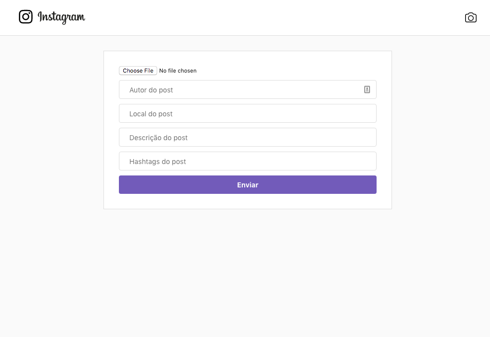

# Instagram Clone (Frontend)
:camera: Sample Instagram clone built with React and AWS-S3

This application is using heroku buildpacks:
* create-react-app: mars/create-react-app

### [Live Demo](https://rlk-instagram-clone-frontend.herokuapp.com/)




### Start API
[Clone the project](https://rlk-instagram-clone-frontend.herokuapp.com/) or test
[the live API](https://github.com/Relirk/instagram-clone-backend)

### Running Locally
```sh
# Install dependencies
yarn install

# Start the app on a new window
yarn start
```
